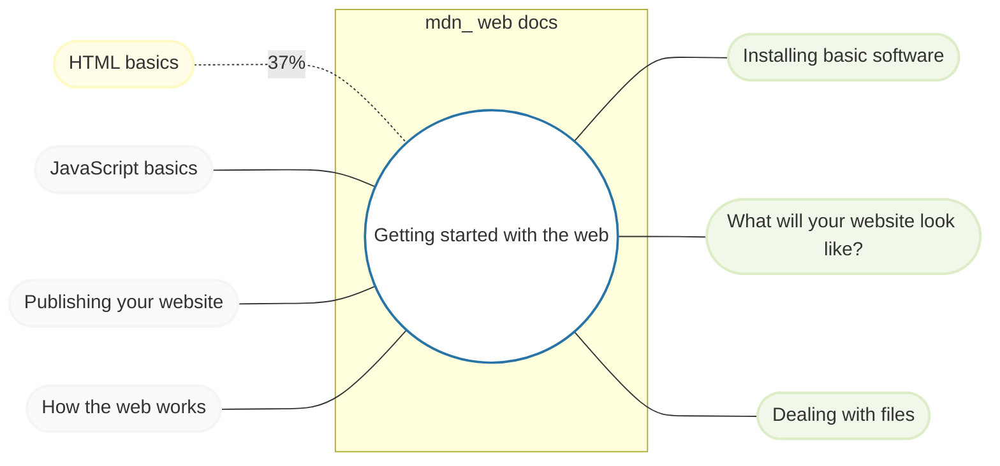

```mermaid

    flowchart LR;
    
    subgraph mdn_ web docs
        id1((Getting started with the web))
        end
        id1 --- id2([ Installing basic software])
        id1 --- id3([What will your website look like?])
        id1 --- id4([Dealing with files])
        id5([HTML basics]) -. 37% .- id1
        id6([JavaScript basics]) --- id1
        id7([Publishing your website]) --- id1
        id8([How the web works]) --- id1
        
        style id1 fill:#FFFFFF, stroke:#2874A6,stroke-width:2px
        style id2 fill:#F1F8E9, stroke:#DCEDC8,stroke-width:2px
        style id3 fill:#F1F8E9, stroke:#DCEDC8,stroke-width:2px
        style id4 fill:#F1F8E9, stroke:#DCEDC8,stroke-width:2px
        style id5 fill:#FFFDE7, stroke:#FFF9C4,stroke-width:2px
        style id6 fill:#FAFAFA, stroke:#F5F5F5,stroke-width:2px
        style id7 fill:#FAFAFA, stroke:#F5F5F5,stroke-width:2px
        style id8 fill:#FAFAFA, stroke:#F5F5F5,stroke-width:2px
        
```
