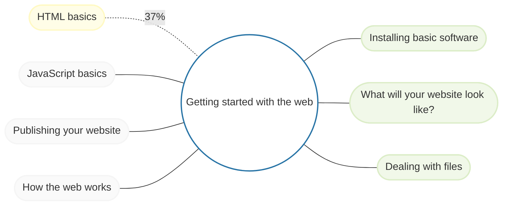

    
 mdn_ web docs 

    
    

    
 GitHub Flavored Markdown Spec 

    1. Introduction
    1.1 What is GitHub Flavored Markdown?
    1.2 What is Markdown?
    1.3 Why is a spec needed?
   
   

