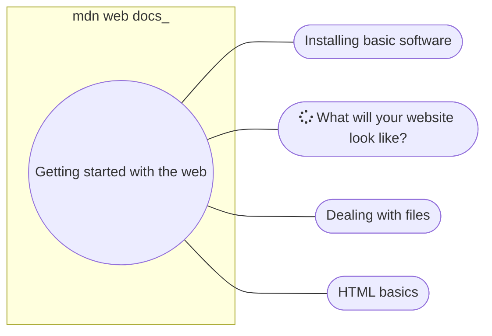

```mermaid

    flowchart LR;
    
    subgraph mdn web docs_
        id1((Getting started with the web))
        end
        id1 --- id2([Installing basic software])
        id1 --- id3([fa:fa-spinner What will your website look like?])
        id1 --- id4([Dealing with files])
        id1 --- id5([HTML basics])

```
